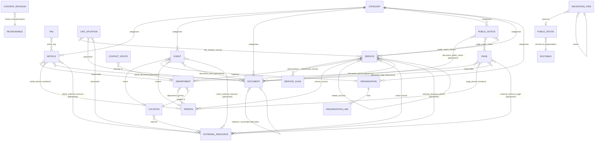

# Content model

Status: domain foundation (phase 2). Functional admin CRUD exists under
`/verwaltung`; the final CMS/public design and WordPress import follow later. Media, search
services, contact, settings, SEO, navigation and quality checks are described
in [site-foundation.md](site-foundation.md).

## Core principle: structured data, stored once

The CMS manages **structured municipal information**, not just pages.
Information that appears in several places exists exactly once and is
**referenced**:

- a person's phone number lives on the `Person`, a department's on the
  `Department` – every page showing it reads it from there;
- a file is uploaded once as a `Document` and *placed* wherever it is needed;
- an important external link (Bürgerserviceportal, BayernAtlas …) is one
  `ExternalResource`, placed wherever it is needed;
- an event is one `Event`, a notice one `PublicNotice`.

Relationships use **explicit tables with foreign keys** wherever the two sides
are known. Polymorphism is used only where it is genuinely the cleanest
design (public URLs, revisions, migration provenance, audit log) – see
[Polymorphic relationships](#polymorphic-relationships).

## Entity-relationship overview



## Entities

All tables use `utf8mb4_unicode_ci`, InnoDB, timestamps; editorial and
directory entities use soft deletes (recycle bin). "Pub" = publication
lifecycle, "Rev" = revisions, "URL" = public route.

| Entity (table) | Purpose | Key fields | Pub | Rev | URL |
|---|---|---|---|---|---|
| `Article` (`articles`) | Aktuelles / news | title, summary (teaser), body, category, tags, author_name, department (responsible), contacts, is_featured, documents & links (placements) | ✓ | ✓ | ✓ |
| `Event` (`events`) | Veranstaltungen | title, description, starts_at/ends_at (UTC), all_day, recurrence_rule (RFC 5545), location *or* venue text, organization *or* organizer_name, contact person, remarks, category, url, registration_url, auto_archive, placements | ✓ | ✓ | ✓ |
| `Document` (`documents`) | every downloadable file | title, description, category, file metadata (path, original_filename, mime_type, extension, size_bytes, sha256), year, document_date, valid_from/valid_until, language, accessibility_status/notes, accessible_alternative, replaces (supersession) | ✓ | ✓ | ✓ |
| `ExternalResource` (`external_resources`) | managed external links / online services | title (descriptive link text), url (validated), type, provider_name, description, privacy_note; publication window = validity | ✓ | ✓ | – |
| `PublicNotice` (`public_notices`) | amtliche Bekanntmachungen (own model, not an Article) | title, summary, body, category, published_on (official date), display window, documents, related pages/services | ✓ | ✓ | ✓ |
| `Service` (`services`) | Bürgerservice-Leistung | title, sort_title (A–Z), aliases (`service_aliases`), summary, body, category, online service (ExternalResource), departments, contacts, related services, placements, sort_order | ✓ | ✓ | ✓ |
| `LifeSituation` (`life_situations`) | Lebenslage | title, summary, body, services (ordered), placements, sort_order | ✓ | ✓ | ✓ |
| `Page` (`pages`) | genuinely editorial pages | title, summary, body, department, contacts, placements | ✓ | ✓ | ✓ |
| `SiteAlert` (`site_alerts`) | temporary banner | title, body, severity, link_url + link_label | ✓ | ✓ | – |
| `Person` (`people`) | employees / contacts – **no photo field** | salutation, academic_title, first/last/display name, job_title, responsibilities, phone, fax, email (public), room, availability, public_notes, departments, is_active, sort_order | – | ✓ | – |
| `Department` (`departments`) | Ämter / Sachgebiete | name, short_name, description, phone, email, location, opening_hours, people, services, is_active, sort_order | – | ✓ | ✓ |
| `Organization` (`organizations`) | one directory for Vereine, Gewerbe, Gastronomie (`type`) | name, type, category, description, contact_name, address, phone, email, website, links (`organization_links`), is_active, sort_order | – | ✓ | ✓ |
| `Location` (`locations`) | Rathaus, Bauhof, Wertstoffhof, Mandichosee … | name, type, description, address, phone, email, opening_hours, latitude/longitude, map link (ExternalResource, never embedded), is_active | – | ✓ | ✓ |
| `ContactRoute` (`contact_routes`) | topics of the contact form | label, explanation (public), **recipients (internal, encrypted)**, department, is_active, sort_order | – | – | – |
| `Category` (`categories`) | manageable categories per context (article, event, document, notice, service, organization) | context, name, slug, description, sort_order | – | – | – |
| `Tag` (`tags`) | article keywords | name, slug | – | – | – |
| `PublicRoute` (`public_routes`) | URL paths of records | path, path_key, routable, is_canonical, canonical_for, is_active | – | – | – |
| `Redirect` (`redirects`) | legacy URL redirects | source_path/key, destination, status_code, is_active, notes | – | – | – |
| `NavigationItem` (`navigation_items`) | menus (independent of URLs) | menu, parent, label, public_route, managed external_resource or url, sort_order, is_active | – | ✓ | – |
| `ContentRevision` (`content_revisions`) | editorial history | revisionable, revision_number, user, summary, snapshot (JSON) | – | – | – |
| `SourceReference` (`source_references`) | migration provenance | referenceable, source_system, source_id, original_url, imported_at | – | – | – |

Persons, departments, organisations and locations use `is_active` instead of a
publication lifecycle: former employees are **deactivated, not deleted**,
because historical records reference them (foreign keys restrict permanent
deletion while referenced).

Media/images, typed site settings and managed search synonyms are implemented
with revisions and permissions; see [site-foundation.md](site-foundation.md).
Visual galleries and the final media-library design follow later.

## Publication lifecycle

Columns on every publishable table: `status`, `publish_at`, `expires_at`,
`archived_at` (UTC).

| Stored `status` | Meaning |
|---|---|
| `draft` | Entwurf – never public |
| `published` | released for publication from `publish_at` (now if empty) until `expires_at` |
| `archived` | deliberately withdrawn to the archive (`archived_at` set) |

The **effective state** is derived at request time from the status and the
current UTC time – no cron job ever flips a status:

| Effective state | Condition |
|---|---|
| Entwurf | status = draft |
| Geplant (scheduled) | status = published, publish_at in the future |
| Öffentlich | status = published, publish_at ≤ now, expires_at empty or > now |
| Abgelaufen (expired) | status = published, expires_at ≤ now – stays `published`, never becomes a draft |
| Archiviert | status = archived |

- Current listings and detail pages use `Model::visible()`.
- `Model::publicArchive()` returns content that *was* public and has ended
  (expired or archived). `PublicNotice`, `Article`, `Event` and `Document` keep
  a public archive (`keepsPublicArchive()`): their URLs stay reachable with an
  "Archiv" note. Pages, services and life situations disappear when expired.
- Allowed transitions: draft → published; published → draft (withdraw) or
  archived; archived → published. Draft → archived is rejected.
- Events with `auto_archive` derive `expires_at` from the end of the event
  (end of day in `SITE_TIMEZONE` for all-day events) on every save.
- All editor input/output uses `SITE_TIMEZONE` via `App\Support\SiteTime`,
  including the DST rules (non-existent times rejected, repeated hour → later
  occurrence, so content never goes live early).
- Recurrence: `recurrence_rule` stores an RFC 5545 RRULE (validated subset:
  FREQ, INTERVAL, COUNT, UNTIL, BYDAY, BYMONTHDAY, BYMONTH, BYSETPOS, WKST).
  Occurrences are expanded in a later phase.

## Authorization philosophy

- Permissions are `<type>.<ability>`, generated from
  `App\Support\Authorization\ContentType` × `Ability` (105 permissions), plus
  `admin.access` and `audit.view`. Code checks permissions through policies
  (`App\Policies\*Policy` → `ContentPolicy`), `can:` middleware and `@can` –
  never role names.
- **Edit ≠ publish.** Users with `edit` but without `publish` can only save
  drafts directly. Any status change, and any direct change to a non-draft
  record (content or publication window), requires `publish`;
  entering/leaving the archive also requires `archive`. For live content,
  editors create **change proposals** (see below).
- **Deletion** moves to the recycle bin (`delete`, also allows restore).
  Permanent deletion requires the separate `force-delete` permission, only from
  the recycle bin, and fails while the record is referenced.
- Roles are defaults for review (generated from code):

| Bereich | Administration | Chefredaktion | Fachbereichsredaktion | Veranstaltungsredaktion | Prüfung |
|---|---|---|---|---|---|
| Artikel (Aktuelles) (`article`) | VCEPADX | VCEPAD | VCE | – | V |
| Veranstaltungen (`event`) | VCEPADX | VCEPAD | VCE | VCEPAD | V |
| Dokumente (`document`) | VCEPADX | VCEPAD | VCE | VCE | V |
| Externe Links & Online-Dienste (`external-resource`) | VCEPADX | VCEPAD | VCE | VCE | V |
| Bekanntmachungen (`notice`) | VCEPADX | VCEPAD | VCE | – | V |
| Bürgerservice-Leistungen (`service`) | VCEPADX | VCEPAD | VCE | – | V |
| Lebenslagen (`life-situation`) | VCEPADX | VCEPAD | VCE | – | V |
| Seiten (`page`) | VCEPADX | VCEPAD | VCE | – | V |
| Hinweis-Banner (`site-alert`) | VCEPADX | VCEPAD | – | – | V |
| Personen (`person`) | VCEDX | VCED | VCE | V | V |
| Ämter & Sachgebiete (`department`) | VCEDX | VCED | VCE | V | V |
| Vereine, Gewerbe & Gastronomie (`organization`) | VCEDX | VCED | VCE | VCE | V |
| Orte & Einrichtungen (`location`) | VCEDX | VCED | VCE | VCE | V |
| Kontaktformular-Themen (`contact-route`) | VCEDX | VCED | – | – | V |
| Kategorien & Schlagwörter (`taxonomy`) | VCED | VCED | V | V | V |
| Navigation (`navigation`) | VCED | VCED | V | – | V |
| Weiterleitungen (`redirect`) | VCED | VCED | V | – | V |
| Medien (`media`) | VCEPADX | VCEPAD | VCE | VCE | V |
| Suchbegriffe (`search-synonym`) | VCED | VCED | – | – | V |
| Website-Einstellungen (`site-settings`) | VCE | VCE | – | – | V |
| Benutzerkonten (`user`) | VCE | – | – | – | – |
| Verwaltungsbereich aufrufen (`admin.access`) | ✓ | ✓ | ✓ | ✓ | ✓ |
| Protokoll einsehen (`audit.view`) | ✓ | – | – | – | – |

V = view, C = create, E = edit, P = publish, A = archive, D = delete (recycle
bin & restore), X = force-delete. The "Prüfung" role is read-only and prepared
for a later approval workflow. Recipient addresses of contact routes are only
visible with `contact-route.edit`.

## Change proposals and review

For content that is published, scheduled or archived (`isPublicationLocked()`),
users with `edit` create a **change proposal** ("Änderung vorschlagen"). The
live version stays public and unchanged until a reviewer approves.

| Step | Who | Effect |
|---|---|---|
| create | `<type>.edit` | snapshot of the live state as base and starting payload (one open proposal per author and record) |
| edit, add/remove placements | author | proposed state validated with the same field rules as a direct edit |
| submit | author | status `submitted` – appears in the review queue (`/verwaltung/freigaben`) |
| withdraw | author | status `withdrawn` |
| reject | `<type>.publish`, not the author | status `rejected`, reason required, visible to the author |
| approve and publish | `<type>.publish`, not the author | changed parts written to the live record, new revision, status `applied` |

- Four-eyes principle by default: nobody approves their own proposal
  (`PROPOSALS_ALLOW_SELF_APPROVAL=false`).
- The proposed state is computed by running the admin form logic inside a
  database transaction that is **always rolled back** – identical behaviour to
  direct edits, no side effects on the live record.
- Proposals cover editorial fields, relations (tags, contacts, …),
  placements of documents/links and child collections (service aliases).
  They never change publication state, URLs or files (publishers do that).
- **Only changed parts are applied** (compared with the proposal's base
  snapshot), so newer live edits to other fields survive. If the live record
  changed the same field since the proposal was created, the reviewer sees a
  conflict and must confirm it explicitly; the proposal then wins.
- Every step is audited (`proposal.created|updated|submitted|withdrawn|
  rejected|applied`); applying creates a content revision naming the
  proposal and its author. Proposals are backend-only, never public, and are
  deleted when the record is permanently deleted; proposals of records in the
  recycle bin can only be rejected or withdrawn.
- Not yet included: e-mail notifications to reviewers/authors.

## URL model

**Navigation is not URL structure.** A record's URL is stored in
`public_routes`, independent of its database ID, its category and its position
in any menu. Menus (`navigation_items`) point to a record's canonical route; a
page can move to another menu section without changing its URL.

- **Convention:** canonical paths have **no trailing slash**
  (`/veranstaltungskalender`, `/buergerservice/personalausweis`,
  `/aktuelles`); the root stays `/`. Internal links, `<link rel="canonical">`
  and XML sitemaps use `PublicPath::absoluteUrl()` on the canonical host
  (`APP_URL`) and are therefore always slashless.
- `path` = canonical form (decoded UTF-8, case preserved, no trailing slash);
  `path_key` = lower-case lookup key (unique, binary collation – "ü" ≠ "u").
  Slash and case variants share a key and cannot be registered twice.
- Every routable record has at most one **canonical** route
  (`canonical_for` = `type:id`, unique). Changing the path **updates the
  canonical row in place** (its id stays stable for navigation) and keeps the
  old path as a non-canonical route that redirects to the new one – old URLs
  never break and never form chains. Re-using a former path swaps it back.
- Reserved paths (backend prefix, `/build`, `/robots.txt`, `/index.php`,
  `/storage`, `/.well-known`, `/up`, `/`) cannot be assigned.
- **Existing (migrated) URLs always take precedence**: routes are never
  changed automatically; conventions only apply to genuinely new records.
- Auto-routed types get a suggested slashless path: `/aktuelles/{slug}`,
  `/veranstaltungen/{slug}`, `/bekanntmachungen/{slug}`,
  `/buergerservice/{slug}`, `/buergerservice/lebenslagen/{slug}`, pages at
  `/{slug}`. Editors may enter any valid path, e.g. the exact legacy path.
- **Opt-in public pages** for departments, locations and organizations: a
  route exists only if an editor enters a path; clearing it withdraws the page
  (route kept inactive, audited `route.deactivated`). People never get public
  profile URLs.
- **Documents** get no automatic detail page. They are linked from contextual
  listings via the stable download URL `/download/{id}/{filename}` (stateless,
  only while publicly reachable, wrong filename → one 301). A deliberately
  assigned route (e.g. a migrated `/wp-content/uploads/…` URL) is the
  canonical download address and takes precedence.
- Public archives (expired/archived content stays reachable) only for
  articles, public notices, events and documents; all other types rely on
  backend revisions/history.

**Redirects** (`redirects`): `source_path` (normalised, unique key),
`destination` (internal slashless path or absolute https URL), `status_code`
(301 default, 302, 410 Gone), `is_active`, `notes`. Rules enforced by
`RedirectManager`:

- duplicate sources (incl. slash/case variants) are rejected;
- a redirect may not shadow an active content route (and a content route may
  not be assigned to an active redirect source);
- loops are rejected; pointing to another redirect is rejected with the final
  target suggested; pointing to a former content path suggests the current one;
- when a new redirect's source is the destination of existing redirects, those
  are re-pointed to the new destination (flattened, audited).

**Resolution** (`ContentController`, stateless fallback route): content routes
take precedence over redirects. Every non-canonical request reaches its final
target in **one 301**, preserving path and query string:
`/veranstaltungskalender/?m=7` → `/veranstaltungskalender?m=7`; a legacy
`/alter-kalender/` redirect goes straight to its destination;
`http://gemeinde-merching.de/alt/` goes straight to
`https://www.gemeinde-merching.de/<final target>` (host/HTTPS normalisation
resolves the final location too). Explicit application routes
(`/verwaltung/login/`) are slash-normalised by `RemoveTrailingSlash`. Apache
deliberately has no generic slash rule (it would add a second hop).

## Placement model (documents and links on content)

Editors upload a document or create a link **once** and *place* it:

```
Document "Haushaltsplan 2026"  → Page "Haushaltspläne" → slot "downloads" → group "2026" → sort 3
ExternalResource "Online-Antrag" → Service "Personalausweis" → slot "online"
```

- One explicit pivot table per owner type and item type (e.g. `document_page`,
  `external_resource_service`) with `slot`, `group_label`, `sort_order`;
  owner FK cascades, item FK **restricts**.
- **Slots are validated identifiers defined in code** per owner type
  (`documentSlots()` / `resourceSlots()`), e.g. Page: `downloads`, `anlagen` /
  `links`, `online-dienste`; Service: `formulare`, `merkblaetter` / `online`,
  `links`; Notice: `bekanntmachung`, `anlagen`. Templates render slots; no
  placement is hard-coded in Blade and there is no free page builder.
- `group_label` is a free heading inside a slot (e.g. year "2026").
- Placement changes are recorded in the owner's revisions.
- "Wo wird diese Datei verwendet?" – `ContentUsage::of($document)` lists all
  placements (including owners in the recycle bin), supersession and
  accessible-alternative references; shown on the document/link edit screen.

## Document model

- Upload through the secure pipeline (`UploadInspector`): extension allowlist
  + MIME detected from the file content, size limit, random storage name on
  the private disk (outside `public/`), sanitised original filename kept as
  metadata, SHA-256. SVG/HTML/executables are rejected.
- Delivery: public only through its public route while publicly reachable;
  backend download for authorised users. Headers: detected `Content-Type`,
  `nosniff`, RFC 6266 `Content-Disposition` (inline only for PDF/images),
  `Content-Security-Policy: default-src 'none'; … sandbox`.
- **Accessibility status** (`accessibility_status`): Nicht geprüft (default
  for every upload – the CMS never claims accessibility), Barrierefrei,
  Teilweise barrierefrei, Nicht barrierefrei, Barrierefreie Alternative
  vorhanden (requires `accessible_alternative_id`), plus notes and `language`
  (BCP 47).
- **Supersession**: the newer document points to the one it replaces
  (`replaces_document_id`, unique); `isSuperseded()`; cycles rejected. Older
  versions stay available (archive) unless deliberately removed.
- `year`, `document_date`, `valid_from`/`valid_until` (legal validity, e.g.
  Satzungen) are separate from the publication window.
- **File deletion**: a file is only physically deleted when its document is
  permanently deleted, which is refused while any reference exists (database
  RESTRICT as second line of defence). Removing a placement never deletes a
  file. Replacing a file on a document deletes the old file after commit.

## Revision model

- Separate from the audit log. Table `content_revisions`: revisionable
  (morph), `revision_number` (per record), `user_id`, `summary` (optional
  change note), `snapshot` (JSON), `created_at`. Immutable.
- Snapshot = **allowlist** per model (`revisionAttributes()`,
  `revisionRelations()` incl. pivot data such as placements). Never: IDs of
  system tables, timestamps, `created_by`/`updated_by`, file storage data,
  publication fields, contact-route recipients (contact routes have no
  revisions), user/credential data.
- Recorded after every save in the admin and every placement change; identical
  states do not create a new revision.
- `RevisionService`: `list()`, `snapshot()`, `record()`, `restore()`. Restoring
  applies the old editorial content (attributes + relations that still exist)
  and **creates a new revision** ("Version N wiederhergestellt"); history is
  never deleted. Publication state is never restored – going live is a separate
  decision. Restoring requires edit rights.
- Child collections (service aliases, organization links) are versioned too.
- Retention: **pending policy decision**; disabled/unlimited
  (`REVISION_RETENTION_DAYS` unset). `php artisan revisions:prune` applies the
  policy once configured and always keeps the newest `REVISION_KEEP_LATEST`
  (20) revisions per record. Independent of the 730-day audit retention.

## Deletion model

| Action | Permission | Effect |
|---|---|---|
| In den Papierkorb | `<type>.delete` (+ `publish` if live) | soft delete; disappears from lists and the public site |
| Wiederherstellen | `<type>.delete` | restores from the recycle bin |
| Endgültig löschen | `<type>.force-delete` (only Administration by default) | only from the recycle bin; refused while referenced; removes placements owned by the record, its routes and source references; document files deleted after commit |

Redirects, navigation items, categories and tags have no recycle bin (deleted
directly, audited). Accounts are never deleted (deactivated).

## Content safety (XSS)

- Rich text is temporarily **Markdown** rendered by `SafeMarkdown`
  (league/commonmark): raw HTML escaped, unsafe link schemes removed, images not
  rendered (no external requests), headings start at h2. Never output editor
  text with `{!! !!}` except through `SafeMarkdown`.
- All other fields are plain text, escaped by Blade.
- Planned: a controlled **block editor** storing typed blocks (paragraph,
  heading, list, quote, table, info box, placement reference, media reference
  with mandatory alt text) as validated JSON, rendered only through allowlisted
  Blade components. No raw HTML block.
- Links are validated with `SafeUrl` (http/https only, no credentials, no
  control characters); the strict CSP is the second line of defence.

## Polymorphic relationships

Used only where the target can be any of many types and the relation is
infrastructure rather than domain data. Each is covered by tests.

| Table | Why polymorphic | Integrity measures |
|---|---|---|
| `public_routes.routable` | one URL space for 10 content types; uniqueness must hold across all types | morph-map aliases; unique `path_key` and `canonical_for`; rows removed on force delete |
| `content_revisions.revisionable` | generic history for 13 types | morph-map aliases; unique (type, id, number); immutable |
| `source_references.referenceable` | optional provenance for any record | unique (system, source id, type); removed on force delete |
| `audit_events.subject` | existing audit log | append-only; retention 730 days |

Placements and contacts are **not** polymorphic: they use explicit tables with
foreign keys on both sides.

## Search foundation

Searchable models implement `App\Contracts\Searchable::toSearchDocument()`
(title, summary, keywords such as aliases, categories, tags,
responsibilities, body). The synchronous MySQL implementation stores these in
`search_entries` with a FULLTEXT index and a literal substring fallback.
Current visibility/routes are checked at query time. Synonyms, filtering,
ranking and optional privacy-conscious statistics are implemented; the public
search UI follows later. Details: [site-foundation.md](site-foundation.md).

## Migration preparation

`SourceReference` records the origin of imported content (`source_system`
e.g. "wordpress", `source_id`, `original_url`, `imported_at`). Old URLs are
preserved by assigning the exact legacy path as canonical route (stored
slashless; the slash variant redirects in one hop) or by a redirect.

## Audit events (CMS)

`content.created`, `content.updated` (changed field names only),
`content.published`, `content.unpublished`, `content.archived`,
`content.unarchived`, `content.deleted`, `content.restored`,
`content.force_deleted`, `revision.restored`, `route.changed`,
`redirect.created|updated|deleted|flattened`, `user.created`,
`user.updated`, `user.roles_changed`. Never content bodies or recipient
addresses – content belongs to revisions.
